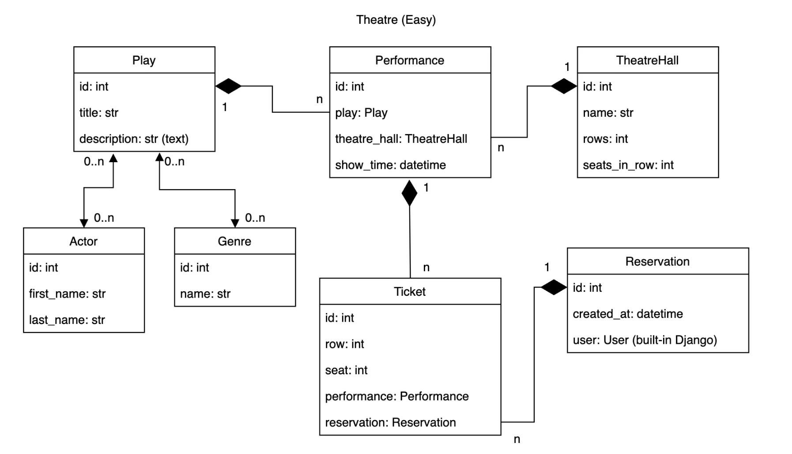

# Theatre Reservation API

A RESTful API service for managing a theatre reservation system.  
Built with **Django**, **Django REST Framework**, **PostgreSQL**, and **Docker**.

---
## DB Structure


## Installing Using GitHub

```bash
git clone https://github.com/your-username/theatre-api.git
cd theatre-api
```

## Run with Docker

Make sure you have Docker and Docker Compose installed.
```bash
docker-compose up --build
```
The API will be available at: http://localhost:8000/api/
Swagger Docs: http://localhost:8000/api/docs/


##  Getting Access

1. Go to the admin panel: http://localhost:8000/admin/
2. Create a superuser:
```bash
docker-compose exec web python manage.py createsuperuser
```
3. Use the superuser credentials to log in and manage models.

##  Features

- 🎭 Play Management: CRUD operations for Plays, Actors, Genres
- 🗓️ Performance Scheduling: Create performance slots in halls
- 🪑 Seat Selection: Users can select specific seat (row, seat) during reservation
- 📦 Nested API Support: Tickets under /reservations/{id}/tickets/
- 🔍 Filtering: Search Plays by title, filter Performances by date
- 🔑 Authentication: Users can only view their own reservations
- 📘 API Documentation: Automatically generated Swagger + ReDoc
- 🐳 Full Docker Support: Easy to deploy and run in containers

## Tech Stack

- Python 3.12
- Django 4.x
- Django REST Framework
- PostgreSQL
- Docker & Docker Compose
- drf-yasg (Swagger docs)

## API Documentation

- Swagger UI: http://localhost:8000/api/docs/
- Redoc: http://localhost:8000/api/redoc/

## Author

Made by Taeyoung Kim 